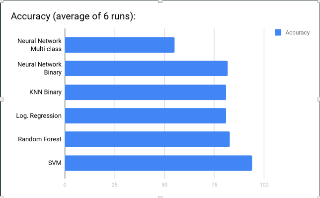

# Heart Disease Prediction using Machine Learning Algorithms from scratch
* Heart is the vital organ of human body, any problem in it reflects on other organs. So our aim is to develop a tool analyse a person has heart disease or not on basis of the given factors which are age,sex, cholesterol and more
* The dataset is taken from UCI.  It has 303 instances and 14 attributes with some null values
* The dataset contains age,sex,chest pain, resting resting blood pressure, cholesterol, fasting blood sugar, resting ECG, maximum heart rate, exercise induced angina, oldpeak, slope, number of vessels colored and thalassemia. The final target or class has values 0,1,2,3 and 4. 0 signifies absence of disease and other show disease presence. For classification we have classified using Neural Networks considering total 5 classes and later on we converted the data to binary classification and implemented SVM, KNN, Logistic Regression

# Description of Dataset
* age : age of the person
* sex : gender of person as  1 for male, 0 for female.
* Chest pain type(cp) : type of chest-pain experienced by person as 1 = typical angina, 2 = atypical angina, 3 = non - anginal pain, 4 = asymptotic
* Resting Blood Pressure(trestbps) : shows the resting blood pressure value of an individual in mmHg (unit)
* Serum Cholesterol (chol) : shows serum cholesterol in mg/dl (unit)
* Fasting Blood Sugar(fbs) : compares the fasting blood sugar value of an individual with 120 mg/dl. If fasting blood sugar > 120 mg/dl then : 1 (true) else : 0 (false)
* Resting ECG(restecg) : 0 = normal 1 = having ST-T wave abnormality 2 = left ventricular hypertrophy
* Max heart rate achieved (thalach) : displays the max heart rate achieved by an individual.
* Exercise induced angina(exang) : 1 = yes 0 = no
* ST depression induced by exercise relative to rest(oldpeak) : displays the value which is integer or float.
* Peak exercise ST segment(slope) : 1 = upsloping 2 = flat 3 = downsloping
* Number of major vessels (0-3) colored by fluoroscopy(ca) : displays the value as integer or float.
* Thal : displays the thalassemia as 3 = normal 6 = fixed defect 7 = reversible defect
* Diagnosis of heart disease(class/target) : Displays whether the individual is suffering from heart disease or not : 0 = absence 1,2,3,4 = present.

# Accuracy Comparison of Various ML algorithms for this datset

